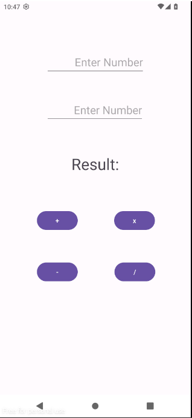
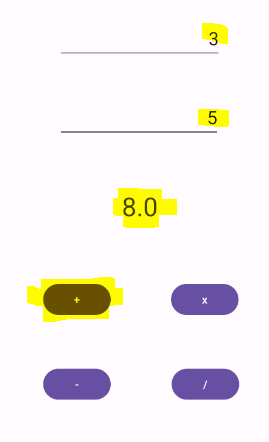
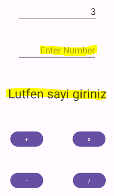
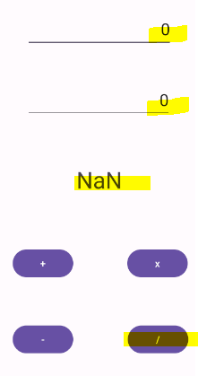
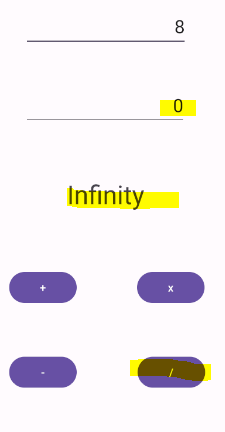

Kotlin project for android aplicaiton.
There are four buttons such as +, -, *, /.
This app calculates among two given numbers

## Version 1.2.0
- Code improvements made.
- Performance enhanced.
- New features added.

## Versiyon 1.2.0
- Kod iyileştirmeleri yapıldı.
- Performans artırıldı.
- Yeni özellikler eklendi.

---

## Ekran Görüntüleri (Screenshots)
### Ana Sayfa (Home Screen)
Türkçe:

### Toplama İşlemi (Addition Process)

### Hata Mesajları (Error Messages)

